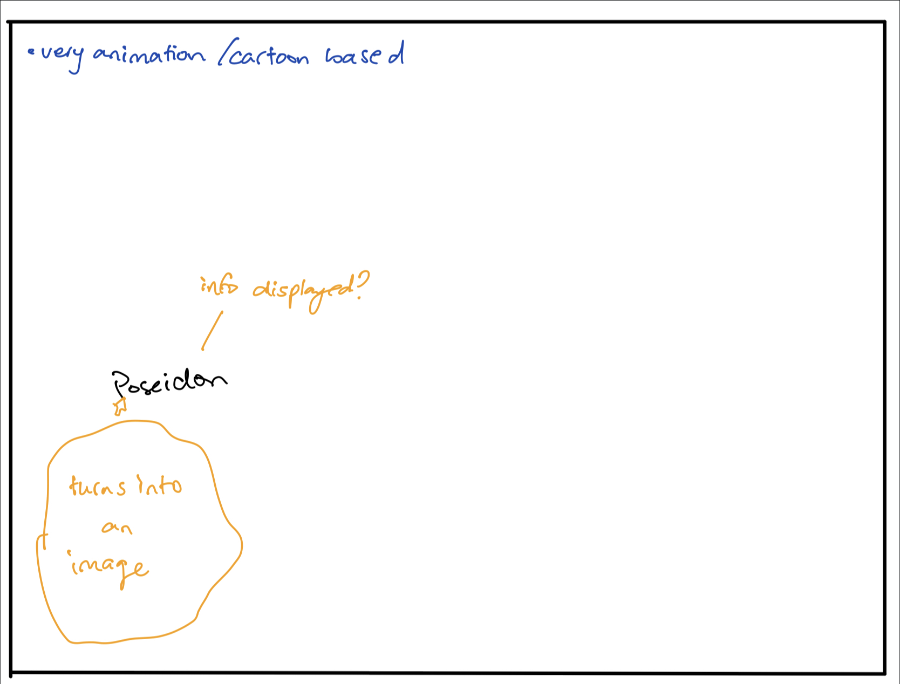
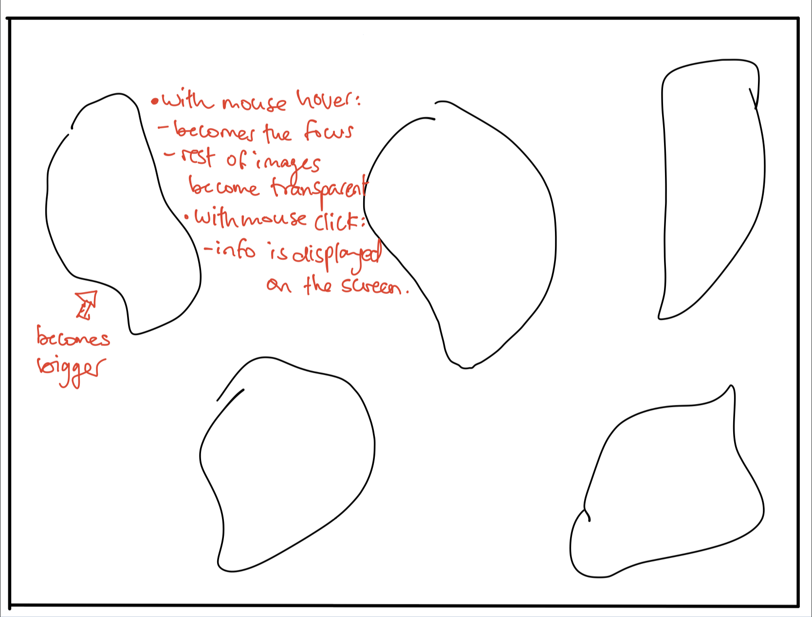

# Project 1 - Data Visualization

## Project Brief

Greek mythology has always been something that has intrigued me. As a kid, reading books was not something that I did often, in fact, I found it quite difficult to finish reading a few chapters, let alone an entire book. Despite all that, I still vividly remember one of the first book series , that consisted of not one, but 5 books, I ever completed and it was the "Percy Jackson and the Olympians" series. That is why, whe I saw a file that consisted of all the different greek gods, I immideately gravitated to it because it brought me back to all those memories. As a kid, I used to visualize a lot, especially when reading, so when all these differnt greek gods were being mentioned in this series, I could not help but wonder what they would look like, what their personality traits are, etc... That is why, I feel like creating a website that displays such information could be extremely beneficial to any future little dreamers who want to have a space to see a manifestation of their dream world.  

## Brainstorming Ideas

Despite being rather excited with my idea, I am still struggling with how to implement it on the web. I have a few ideas on how I want the information to be displayed, but I feel like because I do not have much experience with javascript, I am worried about how the end result will turn out. Regardless, you have to begin somewhere, so here are a few sketches I had of how I envisioned the page to be (Note: I can't draw!):

 

I feel like the whole concept of greek mythology could be extremely aesthetically pleasing. I also wanted to go down an animatin/cartoon route if I consider my audience to be children, so here are also a few images I found as inspiration:

